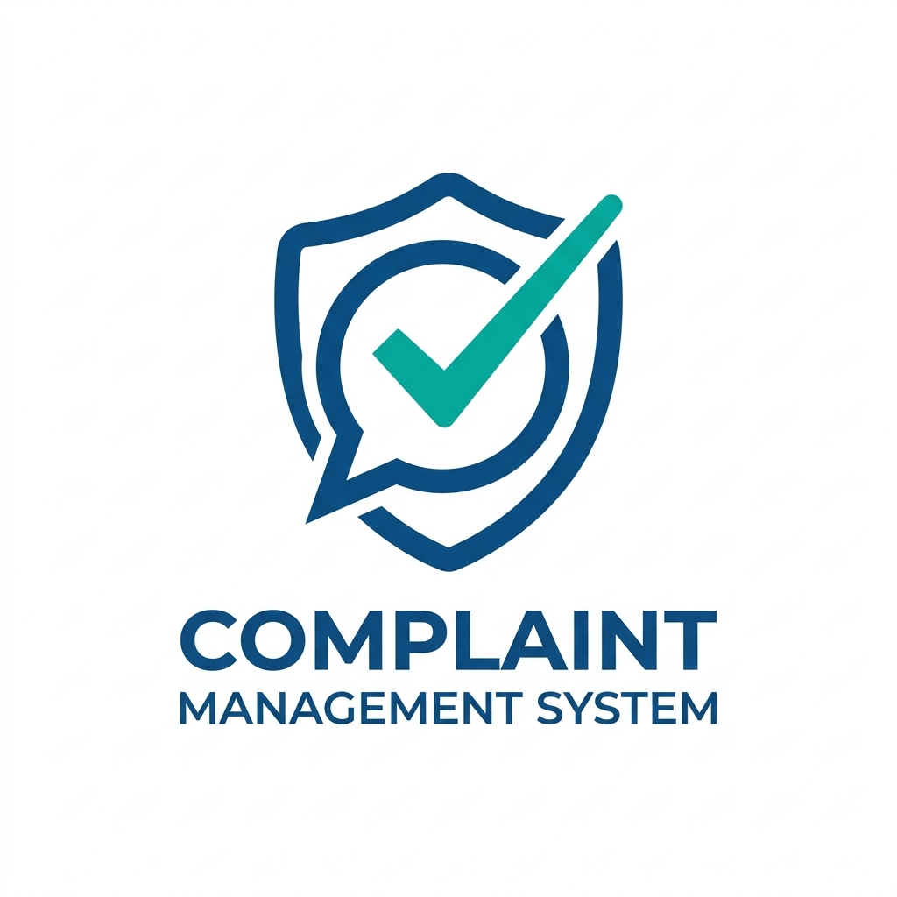
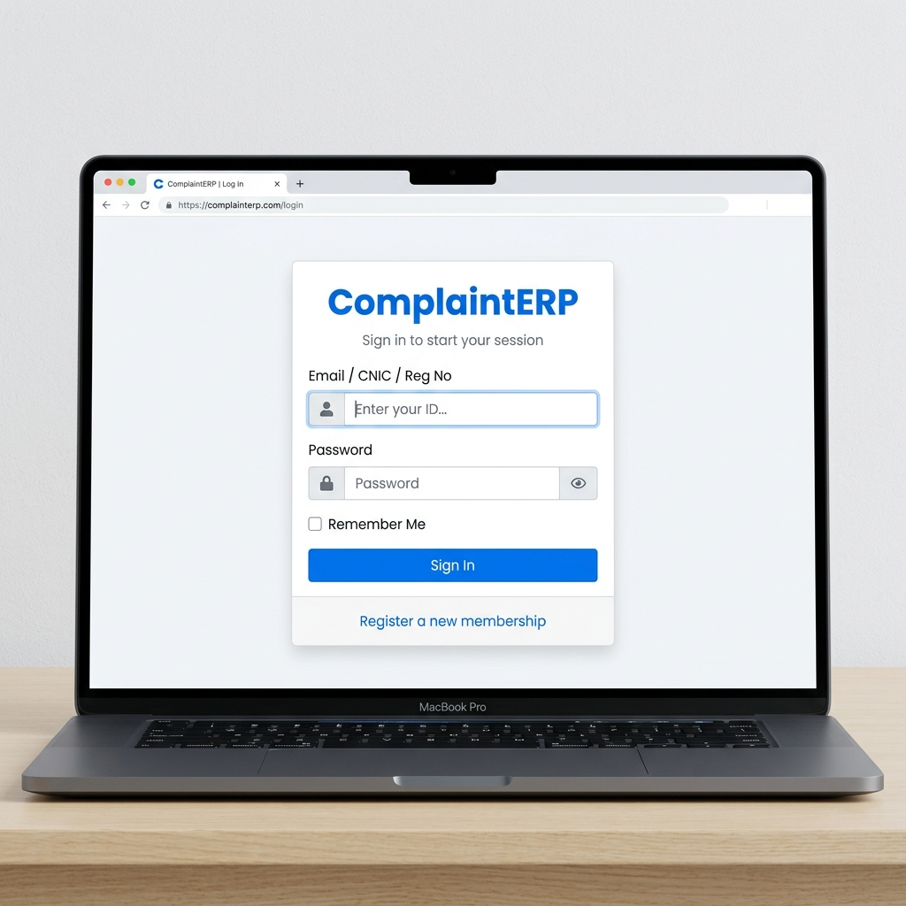
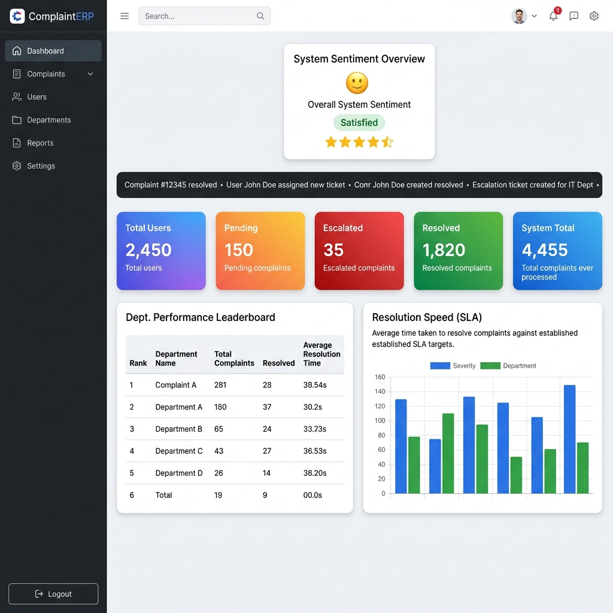
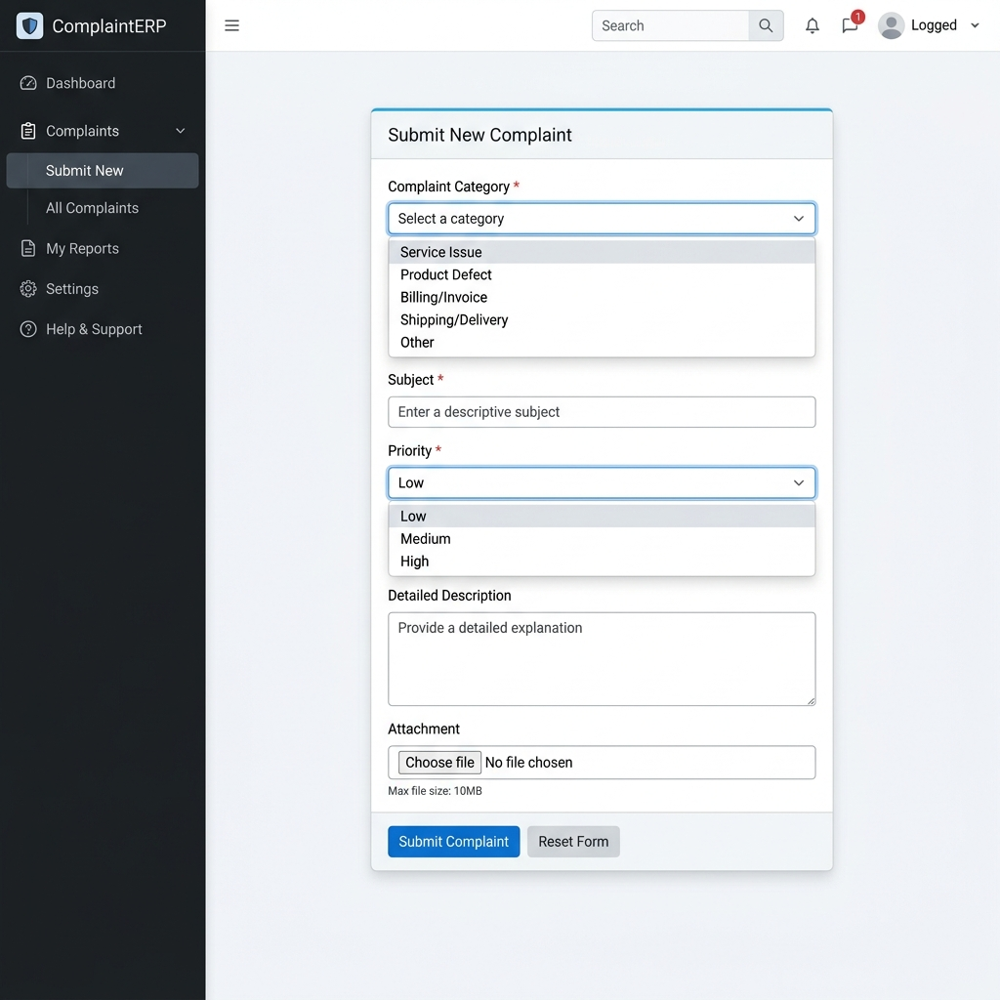

<p align="center">
  
</p>

<h1 align="center">📋 ComplaintERP — Complaint Management System</h1>

<p align="center">
  <strong>A robust, role-based Complaint Management System built for universities, organizations, and enterprises.</strong><br/>
  Efficiently track, assign, escalate, and resolve complaints with real-time dashboards and smart analytics.
</p>

<p align="center">
  
  
  
  
  
</p>

---

## 📖 About The Project

**ComplaintERP** is a full-featured, enterprise-grade complaint management system designed for educational institutions and organizations. It provides a streamlined workflow for submitting, tracking, assigning, escalating, and resolving complaints — all with role-based access control and a beautiful modern UI.

The system supports **multi-identifier authentication** (Email, CNIC, Registration Number), **dynamic RBAC**, **automated escalation**, **real-time sentiment analysis**, and **SLA monitoring**.

> 💡 Built as a final year project with production-grade architecture and security patterns.

---

## 🖼️ Screenshots

### 🔐 Login Page
<p align="center">
  
</p>

### 📊 Admin Dashboard
<p align="center">
  
</p>

### 📝 Submit Complaint
<p align="center">
  
</p>

---

## 🚀 Features

### 🔒 Authentication & Security
- Multi-identifier login (Email / CNIC / Registration No.)
- Password hashing with `password_hash()` (bcrypt)
- Session-based authentication with role checks
- Dynamic ACL (Access Control List) gating via database

### 👥 Role-Based Access Control (RBAC)
| Role | Description |
|------|-------------|
| **Super Admin** | Full system control — manage users, roles, departments, categories, settings, reports |
| **Officer/Staff** | Department-level access — process & resolve complaints in their department |
| **Student/User** | Submit complaints, track status, rate resolutions, view FAQs |

### 📋 Complaint Management
- Submit complaints with category, priority, description, and file attachments
- Auto-assignment to departments based on complaint category
- Real-time complaint status tracking (Pending → In-Process → Resolved → Closed)
- Complaint history with action logs

### 📊 Smart Dashboard
- **Sentiment Analysis** — Real-time system mood based on ratings & resolution rates
- **Live Activity Ticker** — Scrolling feed of latest complaint actions
- **SLA Monitor** — Average resolution time with efficiency rating
- **Dept. Performance Leaderboard** — Ranked by resolved count & satisfaction
- **Issue Distribution Chart** — Category-wise complaint heatmap
- **Escalation Alerts** — Near-deadline complaints flagged in real time

### ⏰ Auto-Escalation Engine
- Complaints pending for **48+ hours** are automatically escalated
- Super Admin is notified immediately via in-app notifications
- Cron-based escalation script for automation

### 🔔 Notification System
- In-app notifications for complaint updates, assignments, escalations
- Mark all as read functionality
- Deep-linked notifications to specific complaints

### 📈 Reports & Analytics
- System-wide reports with filters (date range, department, status)
- Printable report generation
- Activity logs for audit trail

### ⚙️ System Administration
- Manage Departments & Categories
- Manage System Roles & Page Access
- Manage FAQ entries
- Dynamic Sidebar Navigation (database-driven)
- System Settings (Name, Logo, Theme)
- Dark Mode support with persistence

---

## 🛠️ Tech Stack

| Layer | Technology |
|-------|------------|
| **Backend** | PHP 8.x (Object-Oriented, PDO) |
| **Database** | MySQL 8.0+ (UTF8MB4, InnoDB) |
| **Frontend Framework** | AdminLTE 4.0 (Beta) |
| **CSS Framework** | Bootstrap 5.3 |
| **Icons** | Bootstrap Icons 1.11 |
| **Typography** | Google Fonts (Outfit) |
| **Charts** | Chart.js |
| **Server** | Apache (XAMPP) |
| **Auth** | PHP Sessions + bcrypt |
| **Security** | PDO Prepared Statements, RBAC, ACL |

---

## ⚡ How to Install & Setup

### Prerequisites
- [XAMPP](https://www.apachefriends.org/) (PHP 8.x + MySQL + Apache)
- Web Browser (Chrome, Firefox, Edge)
- Git (optional)

### Step 1: Clone the Repository
```bash
git clone https://github.com/kainatjaved487-hue/complaint.git
```
Or download the ZIP and extract to your XAMPP htdocs folder.

### Step 2: Place in XAMPP
```
C:\xampp\htdocs\complaint\
```

### Step 3: Create the Database
1. Open **phpMyAdmin** → `http://localhost/phpmyadmin`
2. Create a new database named: `complaint_db`
3. Import the SQL file:
   ```
   database_phase1.sql
   ```
4. Also import these additional migration files:
   ```
   database_notifications.sql
   database_faqs.sql
   ```

### Step 4: Configure Database Connection
Edit `core/config.php`:
```php
define('DB_HOST', 'localhost');
define('DB_NAME', 'complaint_db');
define('DB_USER', 'root');
define('DB_PASS', '');
define('BASE_URL', 'http://localhost/complaint/');
```

### Step 5: Seed Default Data
Run these scripts in your browser (one time only):
```
http://localhost/complaint/seed_data.php
http://localhost/complaint/run_migration.php
http://localhost/complaint/register_core_admin.php
```

### Step 6: Launch the Application
```
http://localhost/complaint/login.php
```

---

## 🔑 Default Login Credentials

Use these test accounts to explore the system:

| Role | Email | Password | Description |
|------|-------|----------|-------------|
| **Super Admin** | `admin@complaint.com` | `admin123` | Full system access |
| **Officer** | `officer@complaint.com` | `officer123` | Department-level access |
| **Student/User** | `student@complaint.com` | `student123` | Submit & track complaints |

> ⚠️ **Important:** Run `seed_data.php` first, then register these users via `register.php` or create them through the Super Admin panel at `manage_users.php`. Change default passwords after first login!

---

## 📁 Project Structure

```
complaint/
│
├── 📂 assets/                    # Static resources
│   ├── 📂 css/                   # Stylesheets (AdminLTE, Bootstrap)
│   ├── 📂 js/                    # JavaScript files (AdminLTE, Bootstrap, Global)
│   ├── 📂 img/                   # Image assets & avatars
│   └── 🖼️ logo.png               # System logo
│
├── 📂 core/                      # Backend engine (MVC-lite)
│   ├── 🔧 config.php             # Global constants (DB, URL, Paths)
│   ├── 🗄️ db.php                 # PDO database connection
│   ├── 🔐 auth.php               # Authentication class (Login/Register)
│   ├── ⚙️ functions.php          # Utility functions (logging, notifications)
│   └── 🛡️ session.php            # Session middleware & security checks
│
├── 📂 dashboards/                # Role-specific modules
│   ├── 📂 super_admin/           # Admin panel pages
│   │   ├── 👥 manage_users.php       # User directory & management
│   │   ├── 🏢 manage_departments.php # Department CRUD
│   │   ├── 🏷️ manage_categories.php  # Complaint category CRUD
│   │   ├── 🔑 manage_roles.php       # Role & access management
│   │   ├── 📄 manage_pages.php       # Dynamic page registration
│   │   ├── ❓ manage_faqs.php        # FAQ management
│   │   ├── ⚙️ manage_settings.php    # System settings
│   │   ├── 📊 reports.php            # Reports & analytics
│   │   ├── 🖨️ print_report.php       # Printable report view
│   │   └── 📋 activity_logs.php      # System audit logs
│   │
│   ├── 📂 officer/               # Officer/Staff pages
│   │   ├── 📋 all_complaints.php     # View all dept complaints
│   │   ├── ✅ assign_complaints.php  # Assign complaints to staff
│   │   └── ⚡ process_complaint.php  # Process & resolve complaints
│   │
│   └── 📂 user/                  # Student/User pages
│       ├── 📝 submit_complaint.php   # Submit new complaint
│       ├── 📋 my_complaints.php      # View own complaints
│       └── 🔍 view_details.php       # Complaint detail view
│
├── 📂 includes/                  # Shared UI components
│   ├── 🧩 header.php             # Gatekeeper (security + breadcrumbs + settings)
│   ├── 📌 sidebar.php            # Recursive RBAC-aware navigation
│   └── 🔚 footer.php             # Footer scripts & closing tags
│
├── 📂 uploads/                   # User uploaded files
│   └── 📂 complaints/            # Complaint attachments
│
├── 📂 screenshots/               # README screenshots
│
├── 📜 index.php                  # Main dashboard (role-adaptive)
├── 🔐 login.php                  # Login page
├── 📝 register.php               # User registration
├── 👤 profile.php                # User profile management
├── ❓ faqs.php                   # Public FAQ page
├── 🔔 notifications.php         # Notification center
├── 🚪 logout.php                # Session destroy
├── ⏰ cron_escalation.php       # Auto-escalation script (cron job)
├── 🌱 seed_data.php             # Database seeder (departments, categories)
│
├── 📜 database_phase1.sql       # Core database schema
├── 📜 database_notifications.sql # Notifications table
├── 📜 database_faqs.sql         # FAQs table
│
├── 📋 PROJECT_ARCHITECTURE.md   # Architecture reference
├── 📋 requirements.txt          # Project requirements document
└── 📋 README.md                 # 📌 You are here!
```

---

## 🔮 Future Integrations & Roadmap

| Feature | Status | Description |
|---------|--------|-------------|
| 📧 Email Notifications | 🔜 Planned | Send email alerts via PHPMailer on complaint updates |
| 📱 SMS Alerts | 🔜 Planned | SMS notifications via Twilio/API for urgent escalations |
| 📊 Advanced Analytics | 🔜 Planned | Trend graphs, monthly comparisons, department KPIs |
| 🤖 AI Sentiment Analysis | 🔜 Planned | NLP-based analysis of complaint descriptions |
| 📱 Mobile Responsive PWA | 🔜 Planned | Progressive Web App for mobile access |
| 🔗 REST API | 🔜 Planned | API endpoints for third-party integrations |
| 📅 Appointment Booking | 🔜 Planned | Schedule meetings for complaint resolution |
| 💬 Live Chat Support | 🔜 Planned | Real-time chat between users and officers |
| 🌐 Multi-Language Support | 🔜 Planned | Urdu, English language toggle |
| 📑 PDF Export | 🔜 Planned | Export complaints and reports as PDF documents |
| 🔐 Two-Factor Auth (2FA) | 🔜 Planned | Extra security with OTP verification |
| 📊 Excel/CSV Export | 🔜 Planned | Bulk data export for reports |

---

## 🤝 Contributing

Contributions, issues, and feature requests are welcome!

1. Fork the repository
2. Create your feature branch (`git checkout -b feature/AmazingFeature`)
3. Commit your changes (`git commit -m 'Add AmazingFeature'`)
4. Push to the branch (`git push origin feature/AmazingFeature`)
5. Open a Pull Request

---

## 👨‍💻 Author

**Kainat Javed**

- GitHub: [@kainatjaved487-hue](https://github.com/kainatjaved487-hue)

---

## 📄 License

This project is licensed under the **MIT License** — see the [LICENSE](LICENSE) file for details.

---

<p align="center">
  <strong>⭐ Star this repository if you found it helpful! ⭐</strong>
</p>

<p align="center">
  Made with ❤️ using PHP, MySQL, Bootstrap & AdminLTE
</p>
